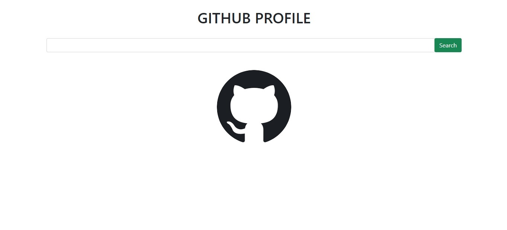

# first-project-react

### Visão geral do projeto

Baseado nas aulas da escola DevSuperior foi desenvolvido uma interface para busca de usuários no Github utilizando os seguintes recursos:

- React
- Bootstrap
- API do Github

### Tela inicial

### Tela após digitar a busca

### Passos do projeto

- Fazer a instalação e configuração de React e Bootstrap
- Criar a estrututura da interface utilizando HTML e Bootstrap 
- Trabalhar com a API do Github
- Programar utilizando recursos para renderizar a interface